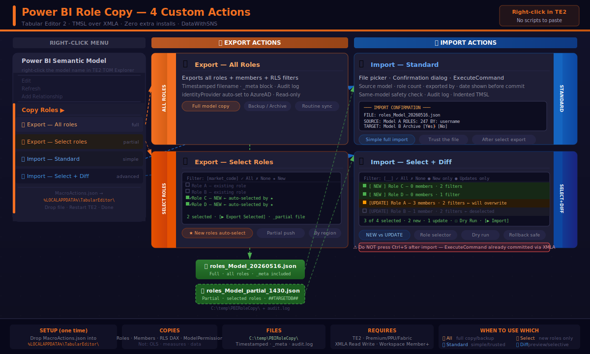

# 🔁 Power BI Role Copy — Tabular Editor 2 Custom Actions

Copy RLS roles, members, and DAX filters between Power BI semantic models using Tabular Editor 2.  
Right-click → done. No PowerShell modules. No SSMS. No scripts to paste.



---

## ✨ Features

| Action | What it does |
|---|---|
| 📤 **Export — All Roles** | Exports every role + member + RLS filter to a timestamped JSON file |
| 📤 **Export — Select Roles** | Checkbox UI to pick specific roles. ★ New auto-selects roles not in previous export |
| 📥 **Import — Standard** | File picker + confirmation dialog. Simple and reliable for full imports |
| 📥 **Import — Select + Diff** | Diff view (NEW vs UPDATE), role selector, dry run mode |

### What gets copied
- ✅ Roles
- ✅ Members (Entra users and groups)
- ✅ RLS DAX filter expressions
- ✅ ModelPermission level

### What does NOT get copied
- ❌ OLS (Object Level Security)
- ❌ Measures, columns, or model data

---

## 📋 Pre-Requisites

| Requirement | Detail |
|---|---|
| **Tabular Editor 2** | Free — [tabular.io/te2](https://tabular.io/te2) or `winget install TabularEditor.TabularEditor2` |
| **Workspace capacity** | Premium, PPU, or Fabric (XMLA endpoint required) |
| **XMLA endpoint** | Must be set to **Read Write** in Capacity Admin settings |
| **Tenant setting** | *Allow XMLA endpoints* = ON in Power BI Admin Portal |
| **Workspace access** | **Admin or Member** on both source and target workspaces (Contributor is not enough) |

> No PowerShell modules, no additional NuGet packages, no admin rights.  
> TE2 ships with AMO/TOM bundled — everything needed is already there.

---

## 🚀 Installation

**One-time setup per machine — 30 seconds.**

1. Download `MacroActions.json` from this repo
2. Close Tabular Editor 2 if it's open
3. Open File Explorer and paste this in the address bar:
   ```
   %LOCALAPPDATA%\TabularEditor
   ```
4. Drop `MacroActions.json` into that folder
   > If a `MacroActions.json` already exists, back it up first — this will replace it.
5. Reopen Tabular Editor 2

**Verify:** Connect to any model → right-click the model name in TOM Explorer → you should see **Copy Roles ▶** with 4 sub-items.

---

## 📖 Usage

### XMLA connection string format
```
powerbi://api.powerbi.com/v1.0/myorg/YOUR_WORKSPACE_NAME
```

### 📤 Export — All Roles
> Use for full model copy, backup, or routine archive sync.

1. TE2 → connect to **source** model
2. Right-click model → **Copy Roles → 📤 Export — All roles**
3. Confirmation popup shows role count and file location → OK
4. File saved to `C:\temp\PBIRoleCopy\roles_<Model>_<timestamp>.json`

### 📤 Export — Select Roles
> Use when you only need to push specific roles (e.g. new roles) to target models.

1. TE2 → connect to **source** model
2. Right-click model → **Copy Roles → 📤 Export — Select roles**
3. Checkbox UI opens — all roles listed
4. Click **★ New** to auto-select roles not present in the previous export file
5. Or type a name/code in the filter box to narrow the list
6. Click **Export Selected**
7. File saved as `roles_<Model>_partial_<timestamp>.json`

> **★ New** compares against the latest `roles_*.json` file in `C:\temp\PBIRoleCopy\`.  
> On first run (no previous file), use the filter box to manually select roles.

### 📥 Import — Standard
> Use after a full export or when you trust the file completely.

1. TE2 → connect to **target** model
2. Right-click model → **Copy Roles → 📥 Import — Standard**
3. File picker opens at `C:\temp\PBIRoleCopy\` — latest file pre-selected
4. Pick the export file → Open
5. Confirmation dialog shows SOURCE → TARGET with role count → **Yes**
6. Done

> ⚠️ **Do NOT press Ctrl+S after import.** `ExecuteCommand` commits directly via XMLA.  
> Pressing Ctrl+S causes a conflict error.

### 📥 Import — Select + Diff
> Use when you want to preview changes, import only specific roles, or do a dry run.

1. TE2 → connect to **target** model
2. Right-click model → **Copy Roles → 📥 Import — Select + Diff**
3. File picker opens → pick file
4. Diff view loads — roles classified as:
   - 🟢 **[ NEW ]** — role does not exist in current model
   - 🟠 **[UPDATE]** — role already exists, will be overwritten
5. Use **● New only** to tick just the new additions
6. Optional: check **Dry Run** → click Import → see preview without committing
7. Click **Import Selected** → confirm → done

---

## 📁 File Structure

All files are saved to one folder, auto-created on first export:

```
C:\temp\PBIRoleCopy\
├── audit.log                                      ← every export + import logged
├── roles_ModelA_20260516_0900.json                ← full export
├── roles_ModelA_partial_20260516_1430.json        ← partial export (selected roles)
└── roles_ModelB_20260515_1620.json                ← another model
```

**Audit log format:**
```
2026-05-16 09:00:21 | EXPORT | Model A | 247 roles | roles_ModelA_20260516_0900.json
2026-05-16 09:02:15 | IMPORT | Model A -> Model B | 247 roles | roles_ModelA_20260516_0900.json
2026-05-16 14:30:05 | EXPORT | Model A | 2 of 247 roles | roles_ModelA_partial_20260516_1430.json
```

---

## 🔒 Safety Features

| Feature | Detail |
|---|---|
| **Timestamped filenames** | No overwrites — every export is a new file |
| **_meta block** | Files include source model, exported by, timestamp, role count |
| **Confirmation dialog** | Shows SOURCE → TARGET before any change is made |
| **Same-model check** | Extra warning if source and target are the same model |
| **Diff view** | See NEW vs UPDATE before committing |
| **Dry run mode** | Full preview with zero risk — no `ExecuteCommand` called |
| **Audit log** | Every export and import recorded with timestamp |

---

## 🛠️ How It Works

Export scripts build a TMSL `sequence` with `createOrReplace` operations for each role.  
The file uses a `##TARGETDB##` placeholder — replaced at import time with the name of whichever model TE2 is connected to.

```json
{
  "_meta": { "sourceModel": "...", "exportedBy": "...", "roleCount": 247 },
  "sequence": {
    "operations": [
      {
        "createOrReplace": {
          "object": { "database": "##TARGETDB##", "role": "Role Name" },
          "role": { "name": "...", "modelPermission": "read", "members": [...], "tablePermissions": [...] }
        }
      }
    ]
  }
}
```

`ExecuteCommand(tmsl)` sends the TMSL directly to Analysis Services via the XMLA endpoint — no Ctrl+S needed.

---

## 🐛 Troubleshooting

| Problem | Fix |
|---|---|
| Menu items don't appear | Verify file is at `%LOCALAPPDATA%\TabularEditor\MacroActions.json` → restart TE2 |
| `identityProvider 'default'` error | Import scripts auto-fix this. If persists, re-export from source |
| Members not visible in Service | Refresh Service page (F5) → check Security tab |
| Could not connect to server | Workspace name is case-sensitive. Verify XMLA Read/Write is ON |
| Error on save after import | You pressed Ctrl+S. Reconnect to model, re-run import, don't save |
| RLS skipped (missing table) | Target model has different table names — update DAX manually |
| ★ New selects nothing | No previous export file found — filter by name manually |
| `System.Drawing` compile error | Scripts require `#r "System.Drawing"` at top — already included in `MacroActions.json` |

---

## 📦 Files in this repo

| File | Description |
|---|---|
| `MacroActions.json` | Drop into `%LOCALAPPDATA%\TabularEditor\` — all 4 actions |
| `docs/PBI_RoleCopy_Infographic.svg` | Visual overview of all 4 actions |
| `docs/PBI_RoleCopy_HowTo_v4.docx` | Full step-by-step guide with screenshots |
| `scripts/TE2_ExportAll.cs` | Export all roles script (standalone paste version) |
| `scripts/TE2_ExportSelect.cs` | Export selected roles script (standalone paste version) |
| `scripts/TE2_ImportStandard.cs` | Import standard script (standalone paste version) |
| `scripts/TE2_ImportDiff.cs` | Import select + diff script (standalone paste version) |

---

## 🤝 Contributing

Issues and PRs welcome. If you find a TE2 version where something breaks, open an issue with the error message and TE2 version number.

---

## 📄 License

MIT — free to use, modify, and share.

---

*Built by [DataWithSNS](https://github.com/SNLSHETTY87) · Power BI developer tooling*
